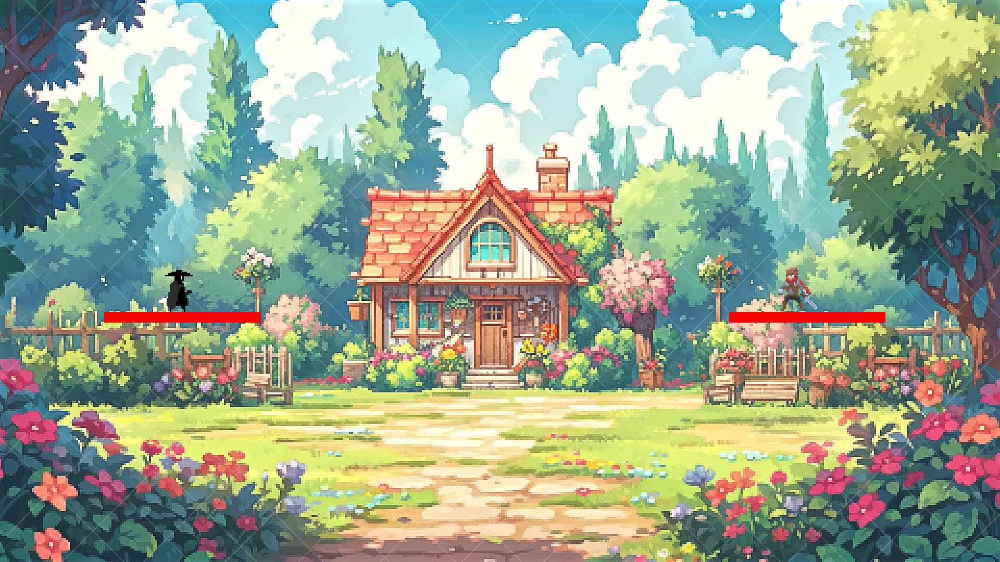

# Pixel Showdown - Functional Specifications

 Table of Contents 

- [Pixel Showdown - Functional Specifications](#pixel-showdown---functional-specifications)
  - [Overview](#overview)
  - [Visuals](#visuals)
  - [Music](#music)
  - [Menu](#menu)
  - [Gameplay](#gameplay)
  - [How to play?](#how-to-play)
  - [Inspiration](#inspiration)

## Overview

The game would deal with a Smash Bros like: 2D versus fighting game with platforms. We could play with 2 players (1v1).
The characters would have a life bar, which decreases each time he gets hit. 3 lives are available.

## Visuals

All the visuals will be in pixel art.

5 maps are expected.
6 characters are expected.

## Music

1 music for the menu, and one for each map are expected.
All characters have different sound effects.

## Menu

At the beginning, a menu is available.

## Gameplay

Each character has his own abilities. Depending on the used ability, a specific animation can occur.

Double jumps are available for all characters. All the characters have the same movement panel (same speed, a dash, etc). They have a shield like Smash Bros.

## How to play?

For the moment, the keybinds are:
1st player:
    - Q-D -> left/right
    - Z -> jump/double jump
    - S -> crouch
    - A-E -> dash left/right
    - C-F-R -> attack 1/2/3
2nd player:
    - K-M -> left/right
    - O -> jump/double jump
    - L -> crouch
    - I-P -> dash left/right
    - N-J-U -> attack 1/2/3

Expected keybinds:
1st player:
    - Q-D -> left/right
    - Z -> jump/double jump
    - S -> crouch
    - E -> dash left/right
    - A -> taunt
    - C-F-R -> attack 1/2/3
    - W-X -> special attacks (at the same time -> ultimate)
2nd player:
    - K-M -> left/right
    - O -> jump/double jump
    - L -> crouch
    - I -> dash left/right
    - P -> taunt
    - N-J-U -> attack 1/2/3
    - ;-: -> special attacks (at the same time -> ultimate)

Controllers are expected to play the game.
Keybinding is not expected.

## Inspiration

We took our inspiration from the Smash Bros license, and other fighting games.
