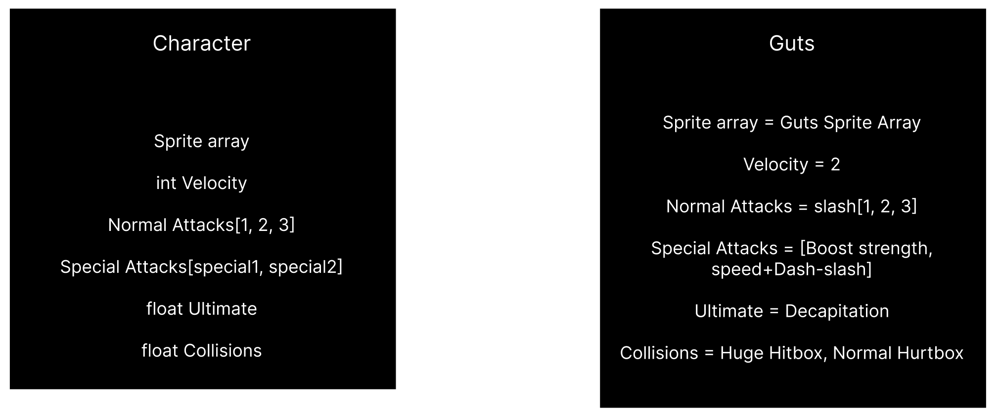

# Pixel Showdown - Technical Specifications

 Table of Contents 

- [Pixel Showdown - Technical Specifications](#pixel-showdown---technical-specifications)
  - [Overview](#overview)
  - [Limitations](#limitations)
  - [Visuals](#visuals)
    - [Characters' visuals](#characters-visuals)
    - [Maps' visuals](#maps-visuals)
  - [Physics](#physics)
  - [Gameplay](#gameplay)
    - [Characters](#characters)
    - [Collisions](#collisions)
      - [Blocking collisions](#blocking-collisions)
      - [Hitboxes](#hitboxes)
      - [Hurtboxes](#hurtboxes)
    - [Map](#map)
    - [Characters' action panel](#characters-action-panel)
  - [Inputs](#inputs)
  - [Resources](#resources)

## Overview

The game would deal with a Smash Bros like: 2D versus fighting game with platforms. We could play with 2 players (1v1).
The characters would have a life bar, which decreases each time he gets hit. 3 lives are available.

## Limitations

The game has to be made with the [C++ programming language](#resources). 
The game has to be made with the [SFML library](#resources). 

## Visuals

### Characters' visuals

Characters will be displayed and animated with 2D pixel art sprites. 
The main spritesheets will be taken from several websites. For more information, refer to the [dedicated part](#resources).
Some specific sprites will be made by ourselves.

### Maps' visuals

The map will be displayed and animated with 2D pixel art sprites. 
The sprites will be taken from several websites as well. For more information, refer to the [dedicated part](#resources).

## Physics

The game contains several physics, such as gravity and velocity. 
Gravity: To reproduce the Earth gravity in game. A varaible that forces the player to stay on the ground is needed. 
Velocity: To reproduce speed in game. A variable that manages the speed of the character is needed.

## Gameplay

### Characters

Characters will be a class. It would contain its sprites, its velocity, its attacks, and its collisions.

### Collisions

Collisions are quite important to ensure the proper functionning of specific things. 

#### Blocking collisions

Blocking collisions stops entities to go further wherever they want to. 

- The entire screen needs to have blocking collisions.
- Platforms need to have blocking collisions.

#### Hitboxes

Hitboxes are attack collisions of a character. The hitboxes have to match with the characters' sprites. 
They interact with opponents' hurtboxes. When a hitbox touches a hurtbox, the dealing damages of the hitbox will be given as received damages to the hurtbox. The dealing damages depend on the attack and the character.

#### Hurtboxes

Hurtboxes are defense colisions of a character. The hurtboxes have to match with the characters' sprites. 
They interact with opponents' hitboxes. The receiving damages depend on the attack and the character. 

### Map

Maps will be where the fights will take place. Platforms will be different for each map. 
The platforms are meant to permit the players to naviguate easier in the map. The fighting gameplay in itself doesn't need them at all.

### Characters' action panel

All characters have the same action panel: run to the left/right, crouch/protect, jump/double jump, use different attacks, use different special attacks, and taunt the enemy. 
Although, speed, attacks and special attacks are different depending on your character. These parameters need to be changed directly on the object parameter. 

## Inputs

Inputs, for now, are on PC. However, controller inputs would be a better experience.  
To do so, we'll need a [special library](#resources).

## Resources

C++: C++ has object-oriented, generic, and functional features, in addition to facilities for low-level memory manipulation for making things like microcomputers or to make operating systems like Linux or Windows. -- [Link](https://en.wikipedia.org/wiki/C%2B%2B)

SFML library: SFML is a graphic library for C++. It provides a simple interface to the various components of your PC, to ease the development of games and multimedia applications. -- [Link](https://www.sfml-dev.org)

Spritesheet: Spritesheet is an image composed of many sprites. It deals with listing all the sprites of a specific entity (e.g. a character). Spitesheets can be found from several websites: [SpritersResource](https://www.spriters-resource.com) - [Itch.io](https://itch.io)

Controller library: [Gainput](https://gainput.johanneskuhlmann.de)
