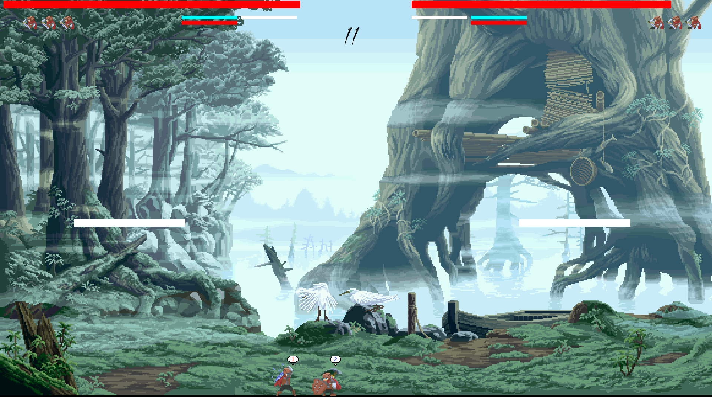
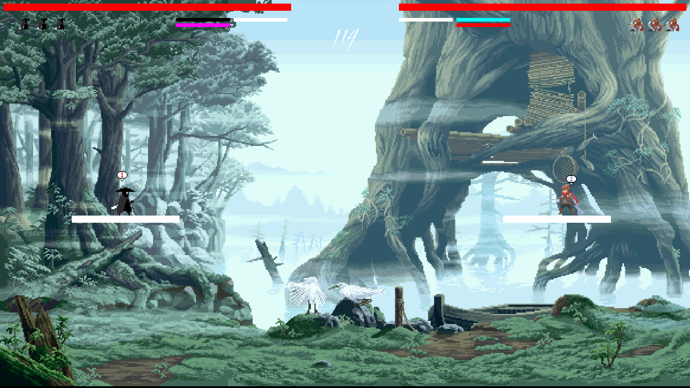

# Pixel Showdown

<b>/!\ PROJECT STILL IN DEVELOPMENT /!\ </b>

The project Pixel Showdown has been started as a worshop in C++ courses, endorsed by Alan Méziane Dahmam at ALGOSUP. 
This game is 2D versus-fighting game. 2 players can play (1v1) with Xbox Controllers.
Each player has 3 lives, and if your opponent doesn't have any lives left, you win! 

## Collaborators 

| Name | Role | Links |
| -- | -- | -- |
| Lucas Megnan | Project Multitasker | [LinkedIn](https://www.linkedin.com/in/lucas-megnan/) |
| Enzo Guillouche | Project Multitasker | [LinkedIn](https://www.linkedin.com/in/enzo-g-b62114293/) |

## Requirements

The game has been made in C++, using the SFML library. You can download it [here](https://www.sfml-dev.org/download.php). 
Be careful, it can be quite hard to install the library properly, don't hesitate to make some research.

## Main Features

Pixel Showdown contains some features that makes him unique:
- Graphics are made in pixel art. Some sprites have been found (open-source only) and some have been made by the collaborators.  

- A versus-fighting game aimed at pleasing either novice or experienced players.
- Some functionalities are hidden, such as combos. You have to find them out by yourself!
- You can participate to the evolution of the project! The collaborators are not professionals, and they can make mistakes. If you find any kind of issues, refer to the GitHub issues or contact the collaborators with their links.

